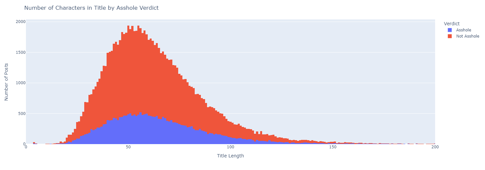
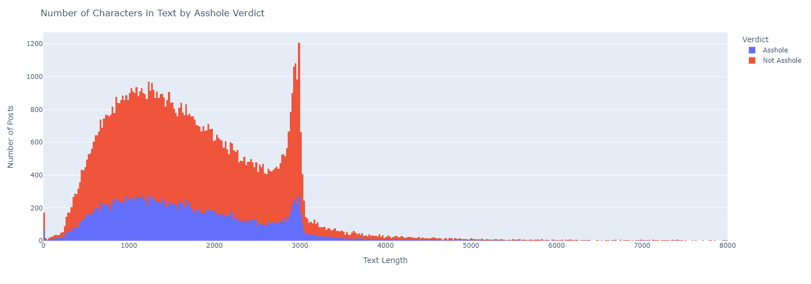
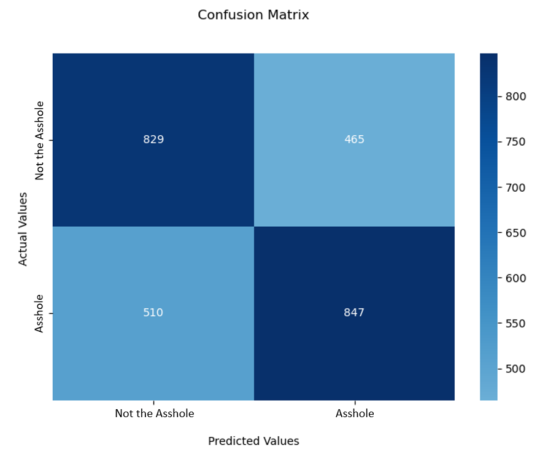
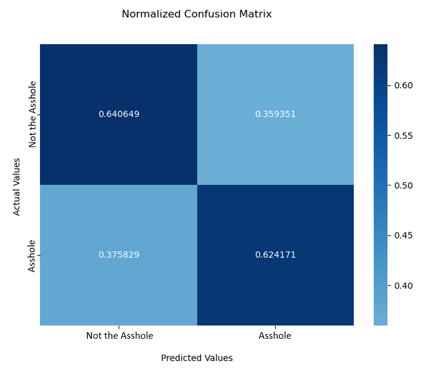
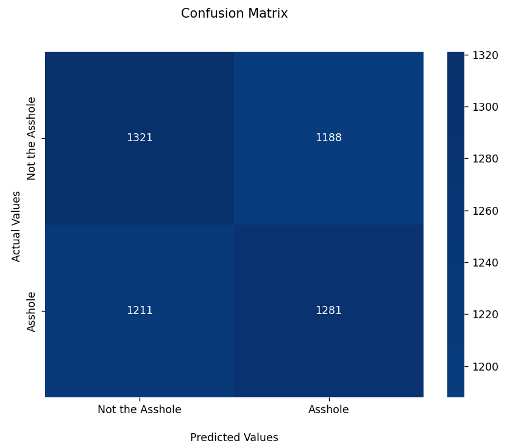
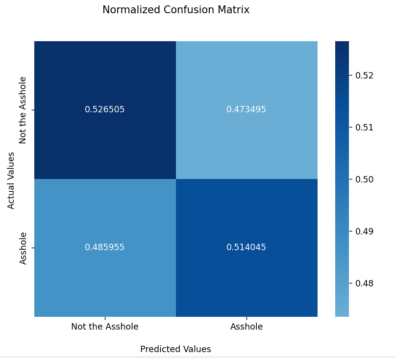
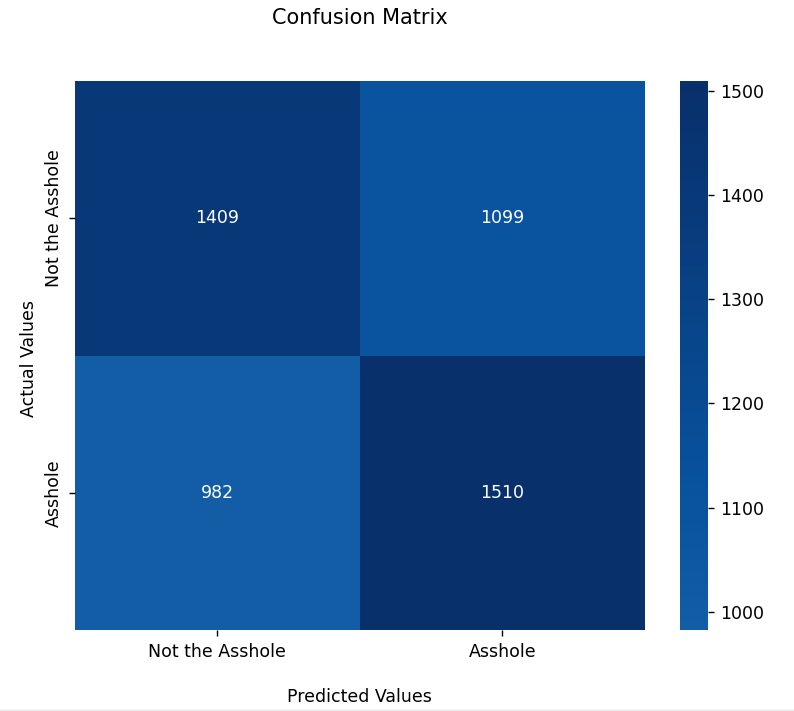
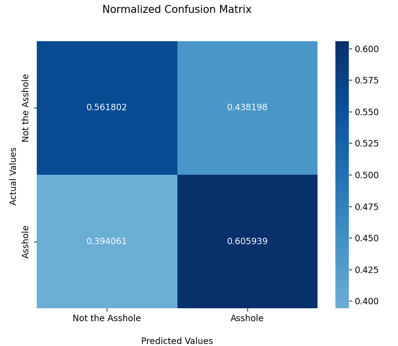
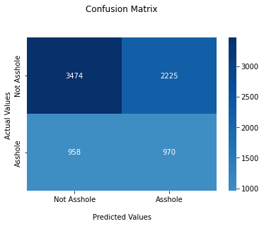
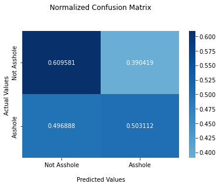

### Introduction

The popular social media site Reddit was founded in 2005 and has become one of the most influential social media platforms in the world. On the site, users can create subreddits, or a forum dedicated to a specific topic. One such subreddit is called “Am I the Asshole?” (AITA), and it allows users to post personal experiences or moral dilemmas so that other users can vote on whether the poster (OP) was in the wrong, or if they were the “asshole.”

### Problem Statement

We aim to use a machine learning based prediction system to determine what verdict a specific post will receive if posted to the AITA subreddit. Such a system can allow users to circumvent the subreddit altogether, which can eliminate hateful or offensive responses that posters are often subject to when voters are passionate about their post. This system can also help us understand how the verbiage chosen to tell a story can affect how people respond to it.

There are tens of thousands of posts on the AITA subreddit that can be accessed using Reddit’s API. We will use a subset of these posts for our predictive model. Each post on AITA has a user, timestamp, title, a varying number of comments, a post body with a character limit of 3,000, and a verdict.

### Data Cleaning and Visualization
Using Reddit API, we collected data from 2012, when the subreddit was created, to 2020. Our current dataset contains approximately 1 million posts, and the items each post contains are as follows: timestamp, title, body, verdict(4 different answers), score, the number of comments, and the final result if the post writer was the “asshole.” For training on BERT, the verdicts were grouped together to convert the problem to that of binary classification. This modification fit naturally with the base dataset since within the verdicts, the two which were combined were already subsets of the parent verdict they were combined with. Some rudimentary data cleaning techniques such as normalizing font case and balancing data classes were performed. As our second and third methods are completed, we plan to use the data from 2021 to measure the accuracy and the precision of our methods. The figures below show the results organized by verdict and the number of characters in the title or text. Although no immediate trends appear from these plots, an important takeaway is the much larger amount of “asshole” verdicts that must be accounted for while training the methods. Additionally, the AITA subreddit generally limits posts to a 3000 character limit, which can be seen in Figure 2.

|  |
|:--:|
| Figure 1. Number of Character in Title by Verdict |

|  |
|:--:|
| Figure 2. Number of Character in Text by Verdict |

### Methods

- Word2Vec (Post2Vec):

Word2Vec is a word embedding technique that takes a group of texts and finds correlations between words by putting them into a vector space. Each vector consists of a few hundreds of dimensions, and a vector in the vector space represents a word. The proximity of any two vectors means that the two vectors are highly correlated. Considering the specificity of posts, we are going to split a post into two parts, title and story, and apply the method for both parts.

- BERT (Bidirectional Encoder Representations from Transformers):

Like the Word2Vec Method, BERT learns contextual relations between words. As its name suggests, BERT supports two-way learning models and transfer learning. Also, it is possible to infer semantic and grammatical information between words.

- Naïve Bayesian

We are looking to compare the accuracy and the precision of Word2Vec and BERT and appropriately combine them. Also, utilizing Naïve Bayesian, we are going to factor not only the posts itself, but the length of a post, gender and age into the process so that we can capture the tendencies that might have significantly affected the results.

### Bert Implementation
We utilized the huggingface library in implementing our Bert model. The huggingface library is a NLP library that provides multiple off the shelf models. In this case, we used the “bert-base-uncased” model within the library. We added an additional linear layer after the pre-trained Bert. When training, we only modify the parameters in the last layer of Bert and the parameters in the added linear layer. This way, we can leverage the pretrained parameters containing semantics of the English vocabulary. We fine tuned the model to our specific task of judging whether a post is considered “asshole.”

#### Results
After training a few models with different hyperparameters, we converged on the following values for the hyperparameters of our Bert model:

| Parameter | Value |
| -- | -- |
| Epochs | 4 |
| Beta coefficients | 0.9, 0.999 |
| Weight Decay | 0.01 |
| Batch Size | 8 |
| Max Length | 500 |

Some of the above parameters were default to the Bert implementation itself, while others were modified, either through trial and error or through independent research on supposedly optimal values. It is worth noting that, as will be discussed further, the results of this method were not as good as desired. This could be evidence of the fact that there is not necessarily a discernible pattern based on the input data of the final verdict of a post on the AITA subreddit, the Bert method is not suitable for this problem, or the hyperparameters have room for optimization.

Our final model reached an accuracy of approximately 63.2%. If we define an asshole verdict as a positive result, we achieved a precision of approximately 83.7%, and a recall of 62.4%. Figure 3 and 4 show the normalized and unnormalized confusion matrices from our model.

|  |
|:--:|
| Figure 3. The confusion matrix for our final Bert-implemented model |

|  |
|:--:|
| Figure 4. The normalized confusion matrix for our final Bert-implemented model |

For all our models, it is worth noting that we only considered data points that received either that “asshole” or “not the asshole” verdict—we did not consider the “no assholes here” or the “everyone sucks here” verdicts. These verdicts make up such a small fraction of the data points that we neglected them.
### Doc2Vec Implementation
We utilized the Gensim library to build our Doc2Vec model, and the nltk library for word tokenizing. Doc2Vec is an extended embedding method for Word2Vec. Both methods require tagged documents and treat the document_id’s as a word that appears in all contexts. For example, the document_id corresponding to the sentence “there is a tall boy” appears as [there, is, a, tall, document_id] in the context of the boy and [there, is, a, boy, document_id] in the context of the “tall.” Eventually, the vector corresponding to the document_id moves in a direction that approaches all the words that appear in the document. So even if the words in the two documents are different, if the vectors in the words are similar, the vectors in the two documents are similar.

We trained the Gensim implementation on a balanced data set of 26,000 posts with an asshole verdict and 26,000 posts with a not the asshole verdict. The Doc2Vec model is an unsupervised method and does not assign labels to the test data on its own, nor does it use the true labels of each data point during training. Therefore, we had to implement our own method for predicting the label of the test data based on the model. We implemented two different prediction methods, and the results of both methods will be discussed further below.

#### Results
After training models with different hyperparameters, we converged on the following values for the hyperparameters of our Doc2Vec model:

| Parameter | Value |
| -- | -- |
| Epochs | 100 |
| Vector size | 300 |
| Window | 15 |
| Alpha | 0.025 |
| Min Alpha | 0.00025 |
| Min count | 1 |
| Topn | 10 |

#### Correlation Classification Method
One method, which we will refer to as the “Correlation Classification Method,” utilized Doc2Vec’s `most_similar()` method. This method takes in a tagged document and a number, “topn,” and returns a list of length topn that contains the tag of the most correlated vectors in the training set and their correlation. We then found the true label of each of these data points, and took the weighted average of the topn correlated vectors to determine the predicted label of the input vector.

With the Correlation Classification Method, we achieved an accuracy of approximately 52.1%, a precision of  51.9%, and a recall of 51.4%. Figure 5 and 6 show the non-normalized and normalized confusion matrices from our model with the Correlation Classification Method.

|  |
|:--:|
| Figure 5. The confusion matrix for Doc2vec model with the Correlation Classification Method |

|  |
|:--:|
| Figure 6. The normalized confusion matrix for Doc2vec model with the Correlation Classification Method |

#### Logistic Regression Method

In our other method, we utilized the Logistic Regression with the word vectors and the true labels of training data. With the method, we achieved an accuracy of approximately 58.4%, a precision of  57.9%, and a recall of 60.6%. Figure 7 and 8 show the non-normalized and normalized confusion matrices from our model with the Correlation Classification Method.

|  |
|:--:|
| Figure 7. The confusion matrix for Doc2vec model with the Logistic Regression |

|  |
|:--:|
| Figure 8. The normalized confusion matrix for Doc2vec model with the Logistic Regression |

### Naive Bayes Implementation

For the Naive Bayes Implementation, we used Pandas Dataframes to perform the necessary calculations and hold the data. To begin with, some characteristics of the data were removed. Those that either could not affect the outcome or would likely not affect the outcome- such as post ID or whether it was edited or not. Other characteristics were modified, such as using the length of the title and text rather than the title and text itself, and getting the hour when a post was made instead of the entire timestamp value. Qualities such as number of comments and score were also ignored, to better predict the outcome without needing responses from others. Finally, the text was filtered to determine a number of new characteristics, such as the gender of the author, whether the author mentioned drugs, if the author used profanity, or if the author’s post was hypothetical (“Would I be the Asshole” vs “Am I the Asshole”). Once these modifications were added to the data, the priors and likelihoods were calculated for the training data set.

#### Results
The final set of predictors used for the Naive Bayes set included the title length, the text length, the hour posted, the gender of the author, whether the post was hypothetical, if profanity was used, and which of the following were mentioned: weed, drugs, parents, children, a girlfriend/wife, and a boyfriend/husband. Using a data set of 90,000 posts to train and ~7000 posts to test, the Naive Bayes implementation predicted the test posts with 58.2% accuracy. With an asshole verdict as a positive result, our implementation had a precision of 30.35% and a recall of 50.3%. Figures 9 and 10 show the confusion matrix and normalized confusion matrix.

|  |
|:--:|
| Figure 9. The confusion matrix for our Naive Bayes implementation |

|  |
|:--:|
| Figure 10. The normalized confusion matrix for our Naive Bayes implementation |

### Conclusion
We first use F1 scores to evaluate the effectiveness of reach of the respective models. Using the data from the results section, Bert has a F1 score of 62.8, Doc2Vec with the correlation classifier has a F1 score of 51.7, Doc2Vec with logistic regression classifier has a F1 score of 59.2, and Naive Bayes has a F1 score of 54.0. From these results, we see that the model can be ranked from best to worse in the following manner: Ber, Doc2Vec with logistic regression classifier, Naive Bayes, Doc2Vec with correlation classifier. Below, we will discuss ways to increase the performance of each method individually. After that, we will provide a more in depth analysis of the results.
#### Improvements to the Bert Model
We fine-tuned the Bert model with 4 epochs, with a batch size of 8 and a max length of 500. Due to the hardware limitations resulting in a long time to train the model, the only hyper parameter we changed was Beta coefficients. We tested the values of 0.9 and 0.999. There are several places that we could improve.

First, the authors of bert recommend a fine-tuning batch size of 16 or 32. Increasing the batch size will probably increase performance by allowing the model to generalize better. However, we were not able to afford increasing the batch size due to hardware limitations.

In addition, most of the posts are longer than 500 words and due to Bert's limitation of 512 tokens, we had to take the first 512 words of each post. This might decrease the model's ability to make correct predictions as words that are vital to the prediction might be in later parts of the sentence. That being said, instead of truncating the oversized post, we could use naive/semi naive approaches to select part of the original test, or divide sentence into chunks and train several Bert models on each chunk and join the resulting vector representations.

#### Improvements to the Doc2Vec Model
We used the logistic regression classifier and the correlation classifier to test the Doc2Vec model. The result shows that logistic regression outperforms correlation classifiers. To improve the model’s performance, we could also try a single-layer perceptron network after the Doc2Vec vectors and train the network with the dataset. It could also be interesting to explore the effects of pre-pruning the vocabulary of the posts. For example, removing commonly shared words such as “the” or “and”. Furthermore, adding higher influence to words which occur less frequently could help increase accuracy. It may be that some rarely used words carry a certain level of emotional charge which could lend to deciding if a post would be marked “Asshole” or “Non-asshole”.

#### Improvements to the Naive Bayes model:
We didn’t sample equal amounts of training and testing samples for Naive Bayes. This might result in the model adapting into the distribution of “Assholes” vs “Non-assholes” posts in the training dataset. The model might be biased as it is trained on a dataset that might not represent the correct prior distribution of the two classes. In addition, the performance of Naive Bayes could be high if the prior distributions of the testing dataset matches the training dataset.

#### Analysis of results of the models:
We think that Naive Bayes method provides a good baseline for our task. As a rule based and simple to implement method, Naive Bayes shows us the efficacies of using more complex methods such as Bert or Doc2Vec. Using this as a baseline we can see that Doc2Vec performed poorly, and Bert performed quite well. The difference between Doc2Vec and Bert’s performance most likely stems from the fact that Bert takes into account the contextual relationships between words whereas Doc2Vec cannot detect that. Furthermore, Doc2Vec attempts to first detect the sentiment of the documents provided to it to then categorize the document into what it is about. In this application, we do not care what the document is about but rather if it will receive an “Asshole” or “Non-asshole” rating; this is likely the cause of its extremely poor performance. A combination of the methods listed above might yield better performance, for example, using Bert or Doc2Vec to find the words with the most impact on a posts categorization and then using these words in particular for the fitting of the Naive Bayes net.

### References

Mali, A., & Sedamkar, R. Prediction of Depression Using Machine Learning and NLP Approach, International Journal of Intelligent Communication, Accessed February 21, 2022, Retrieved from [https://www.ijiccn.com/images/files/vol2-issue1/Prediction-of-depression-using-Machine-Learng-and-NLP-approach.pdf](https://www.ijiccn.com/images/files/vol2-issue1/Prediction-of-depression-using-Machine-Learng-and-NLP-approach.pdf)

Wang, I. “Am I the Asshole?”: A Deep Learning Approach for Evaluating Moral Scenarios, Stanford University, Accessed February 21, 2022, Retrieved from [http://cs230.stanford.edu/projects_spring_2020/reports/38963762.pdf](http://cs230.stanford.edu/projects_spring_2020/reports/38963762.pdf)

Botzer, N., Gu, S., Weninger, T. (2021) Analysis of Moral Judgment on Reddit. Retrieved from [http://arxiv.org/abs/2101.07664 arXiv:2101.07664](https://arxiv.org/abs/2101.07664)

Sarat, P., Kaundinya, P., Mujumdar, R., Dambekodi, S. (2020) Can Machines Detect if you’re a Jerk?, Retrieved from [https://rohitmujumdar.github.io/projects/aita.pdf](https://rohitmujumdar.github.io/projects/aita.pdf)

Jang, B., Kim, I., & Kim, J. (2019) Word2vec convolutional neural networks for classification of news articles and tweets. PLOS ONE 14(8): e0220976. Retrieved from [https://doi.org/10.1371/journal.pone.0220976](https://doi.org/10.1371/journal.pone.0220976)

O'Brien, E. (2020). iterative/aita_dataset: Praw rescrape of entire dataset (v.20.1.2). Zenodo. Retrieved from [https://doi.org/10.5281/zenodo.3677563](https://doi.org/10.5281/zenodo.3677563)
